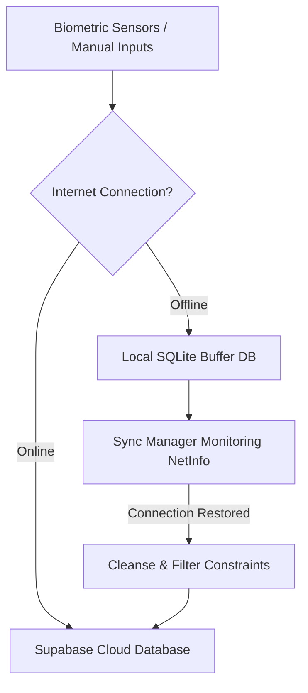

# AquaAyur 🌿📱

AquaAyur is a modern, production-grade mobile health and wellness platform built on **React Native (Expo)**, **TypeScript**, **Zustand**, **SQLite**, **Supabase (PostgreSQL)**, and **Groq AI**. 

It merges the ancient medical wisdom of **Ayurveda** (Dosha bio-energetic assessment, tastes, lifestyle corrections) with state-of-the-art **IoT biometrics** streamed via Bluetooth Low Energy (BLE) from an ESP32 wearable sensor suite or simulated device.

---

## 🚀 Key Core Features (Deep-Dive)

### 📊 1. Intelligent Health & Recovery Dashboard
* **Dynamic Wellness Index:** Calculates a daily Health & Recovery Index dynamically by aggregating the user's last 24-48 hours of average heart rate, skin temperature, and sleep scores.
* **Trend Indexing:** Compares active metrics against yesterday's benchmarks (e.g. `+4 points vs yesterday`) to show immediate health trajectory.
* **Ayurvedic Recommendation Engine:** Suggests real-time personalized daily recommendations depending on biometric states (e.g. balancing Pitta if skin temperature rises, or grounding Vata if heart rate fluctuates).
* **Offline Logger Modals:** Log sleep duration, bedtime, and wake times offline which queue automatically for cloud syncing.

### 👤 2. Ayurvedic Digital Twin
* **Bio-Energetic Balances:** Visualizes the dynamic distribution of the user's active **Vata**, **Pitta**, and **Kapha** bio-energies using customized SVG radar and polygon charts.
* **Agni Metabolic Core Analyzer:** Computes the daily strength of the user's digestive fire (Agni) based on circadian meal timing, diet quality, vitals, hydration levels, physical activity, and sleep.
* **Ojas Vitality Shield:** Measures the user's physiological immune shield (Ojas) based on heart rate variability (HRV), sleep staging, and hydration consistency.
* **Interactive Lifestyle Simulation Engine:** Lets users run simulated scenarios (e.g., waking during Brahma Muhurta, eating warm spiced meals, doing yoga, sleeping early) to see the projected impact on their Doshas, Agni, and Ojas before executing them in real life.
* **AyurExplanationSheet:** Tapping on recommendations reveals clinical rationales contextualized with live biometric data.

### 🧘 3. Circadian Dinacharya Router & Breathing Coach
* **Circadian Routine Planner:** Organizes the day into morning, afternoon, and evening phases, providing specific recommendations for Brahma Muhurta Awakening, Ushapan Hydration, solar-peak Ahara (midday meal), Vyayama (exercise), and Nidra (sleep).
* **Interactive Pranayama Coach:** Guided breathing tool supporting alternate-nostril breathing with a real-time visual progress timer (4s Inhale, 4s Hold, 4s Exhale) to pacify Vata wind and balance the nervous system.
* **Quick Loggers:** Single-tap logging buttons for sleep and hydration.

### 💬 4. Personal AI Ayurvedic Coach Chat
* **Conversational Expert:** Chat directly with an AI coach loaded with Ayurvedic texts. It uses Llama3 via Groq to answer dietary, herbal, and daily routine questions.
* **Structured Cards UI:** Features rich interactive cards displaying custom insights, recommended routines, or recipes.
* **Automatic Output Sanitizing:** Sanitizes messages by stripping markdown ticks, cleaning trailing tags, parsing raw JSON responses, and converting lists to clean, human-readable bold bullet points.

### 🌐 5. ESP32 Wearable Bluetooth Low Energy Integration
* **Real-Time Data Streaming:** Connects to the custom AquaAyur wearable to stream live telemetry (Heart Rate, Skin Temperature, Steps, and active Activity state).
* **Persistent Pairing Profiles:** Persists paired hardware details (MAC address and friendly name) to the backend database.
* **Manual Autoconnect:** Restores connection to the previously paired wearable immediately on app start or upon explicit trigger via the **Previously Paired Device** dashboard card.
* **Robust Cancellation Interceptors:** Case-insensitive check filters that catch and suppress native BleError messages when connections are cleanly cancelled or the app context unmounts.
* **Permissions Module:** Fully handles scan, connect, and legacy location permissions dynamically.

### 🍽️ 6. AI Food Journal & Analysis
* **Smart Calorie Tracker:** Log foods, meal times (Breakfast, Lunch, Dinner, Snack), and portion sizes.
* **Ayurvedic Taste & Dosha Mapping:** AI-powered analysis resolves the Ayurvedic taste (Sweet, Sour, Salty, Bitter, Pungent, Astringent) and outlines its positive or negative effects on the user's dominant Dosha.
* **OCR Scanner:** Features a nutrition label camera scanner to analyze macronutrients (Carbs, Protein, Fat, Fiber) and log entries instantly.

### 💻 7. BLE Virtual Wearable Simulator Lab
* **Real-Time Simulation Control Panel:** Simulates an active physical wearable transmitting telemetry data packets.
* **Dosha Imbalance Presets:** Test app behavior under extreme profiles (Vata Out of Balance, Pitta Out of Balance, Kapha Out of Balance, or Healthy Equilibrium).
* **Physical Scenario Presets:** Pre-programmed setups for Exercise Surge, High Stress/Anxiety, Deep Sleep, and Normal Rest.
* **Interactive Telemetry Sliders:** Manually adjust Heart Rate, Skin Temperature, Steps, and Activity state variables on the fly.

### 📈 8. Weekly Analytics & Groq Reports
* **Auto-Compilation:** Checks if the user has biometric logs but no report, and automatically compiles their initial week-long wellness overview using Groq Llama3 analysis.
* **Historical Trends:** Dynamic line graphs rendering metrics (Heart Rate, Skin Temperature, Steps, Sleep) across the last 7 days.
* **Baseline Normalization:** Normalizes missing data using overall historical telemetry averages rather than generic hardcoded values.

---

## 🛠️ Technology Stack & Libraries

| Dependency | Purpose | Version |
| :--- | :--- | :--- |
| **Expo Router** | Native routing using a file-based structure | `~56.2.14` |
| **React Native** | Cross-platform native application framework | `0.85.3` |
| **NativeWind & Tailwind CSS** | Unified styling and design tokens | `^5.0.0-preview.4` |
| **react-native-ble-plx** | Handles Bluetooth Low Energy interactions, scans, and subscriptions | `^3.5.1` |
| **expo-sqlite** | Fast local SQLite database for offline buffering | `~56.0.5` |
| **Supabase JS Client** | Remote database client and authentication interface | `^2.106.2` |
| **@clerk/clerk-expo** | Secure authentication provider integration | `^2.19.31` |
| **@groq/sdk** | Connects to high-performance Llama3 endpoints for OCR, chat, and reports | Latest |
| **react-native-safe-area-context** | SafeArea inset calculators for multiple screen sizes | `~5.7.0` |
| **react-native-reanimated** | Fluid micro-animations and screen transitions | `4.3.1` |

---

## 🔄 Offline Sync Architecture

AquaAyur implements a robust offline-first synchronization strategy. Telemetry, hydration, and sleep logs captured offline are stored in a local SQLite queue and dynamically uploaded to Supabase PostgreSQL when internet connectivity is re-established.

---

## 🗄️ Database Schemas

### ☁️ Supabase Cloud (Postgres SQL)
Every table is secured with Row Level Security (RLS) policies checking `(auth.jwt() ->> 'sub') = user_id`.

* **`profiles`**: Primary user demographic details, goals, and onboarding `dominant_dosha`.
* **`medical_conditions` / `allergies` / `food_preferences` / `health_goals`**: Normalized tables storing user-specific onboarding profile items.
* **`lifestyle`**: 1:1 relation with user profiles tracking sleep duration average, stress levels, and exercise frequency.
* **`devices` & `pairings`**: Device catalog (uniquely mapping MAC addresses) and pairing states.
* **`heart_rate_logs`**: Timestamps, heart rates, and HRV values. Restricted to `bpm > 0 AND bpm < 300`.
* **`temperature_logs`**: Skin temperatures restricted to `temperature_celsius > 30.0 AND temperature_celsius < 45.0`.
* **`activity_logs`**: Step metrics, calorie estimations, and classifications (`sedentary`, `walking`, `running`, `yoga`, `other`).
* **`sleep_logs`**: Bedtime, wake time, sleep stages (Deep, Light, REM, Awake), and calculated sleep score.
* **`hydration_logs`**: Hydration increments in mL, tracking source context (`manual`, `wearable_alert`, `ai_recommendation`).
* **`food_logs` & `nutrition_analysis`**: Logged meals connected to macronutrient levels and analyzed Ayurvedic qualities.
* **`ai_insights` & `chat_history`**: Cached weekly analysis results and chat histories.

### 💾 Local Cache (SQLite)
Maintained using `expo-sqlite` to buffer offline:
* **`offline_telemetry`**: `(id, timestamp, heart_rate, skin_temperature, steps, activity)`
* **`offline_hydration`**: `(id, timestamp, amount_ml, source)`
* **`offline_sleep`**: `(id, start_time, end_time, duration_minutes, sleep_score)`

---

## 📄 License

This project is licensed under the MIT License - see the [LICENSE](LICENSE) file for details.
