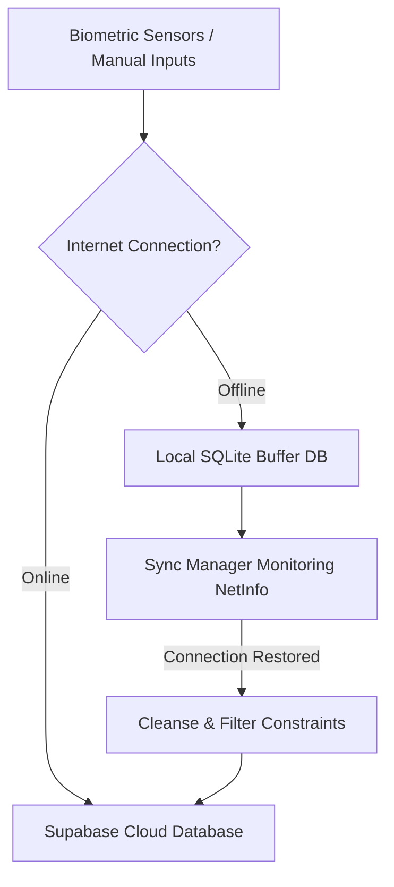

# AquaAyur 🌿📱

[](https://docs.expo.dev/versions/v56.0.0/)
[](https://reactnative.dev/)
[](https://www.typescriptlang.org/)
[](https://supabase.com/)
[](https://groq.com/)

AquaAyur is a modern, production-grade mobile health and wellness platform built on **React Native (Expo)**, **TypeScript**, **Zustand**, **SQLite**, **Supabase (PostgreSQL)**, and **Groq AI**. 

It merges the ancient medical wisdom of **Ayurveda** (Dosha bio-energetic assessment, tastes, lifestyle corrections) with state-of-the-art **IoT biometrics** streamed via Bluetooth Low Energy (BLE) from an ESP32 wearable sensor suite or simulated device.

---

## 🛠️ Quick Start & Setup Guide

### 📋 Prerequisites
To run this project, make sure you have the following installed on your machine:
* **Node.js** (v18 or v20 recommended)
* **npm** (included with Node.js)
* **Expo CLI** (run via `npx expo`)
* **For Native Builds (Android/iOS):**
  * Android Studio & Android SDK (for Android Emulators/devices)
  * Xcode & CocoaPods (for iOS Simulators/devices, macOS only)
  * *Note: Physical Bluetooth (BLE) scanning and connection requires a physical device running a native development build.*

---

### ⚙️ Step 1: Clone & Install Dependencies
First, clone the repository and install the project dependencies:
```bash
npm install
```

---

### 🔑 Step 2: Environment Configuration
Create a local `.env` file in the root directory by copying the example template:
```bash
cp .env.example .env
```
Open the `.env` file and populate it with your configuration credentials:
```ini
# Supabase Configuration
EXPO_PUBLIC_SUPABASE_URL=https://your-project-id.supabase.co
EXPO_PUBLIC_SUPABASE_ANON_KEY=your-supabase-anon-key

# Groq API Configuration (used for AI Chat, Food Journaling & Report compilation)
EXPO_PUBLIC_GROQ_API_KEY=gsk_your_groq_api_key

# Clerk Authentication Configuration
EXPO_PUBLIC_CLERK_PUBLISHABLE_KEY=pk_test_...
EXPO_PUBLIC_CLERK_SECRET_KEY=sk_test_...
```

---

### 🗄️ Step 3: Database Setup (Supabase)
1. Set up a project on your [Supabase Dashboard](https://supabase.com/).
2. Open the **SQL Editor** in the Supabase Dashboard.
3. Copy and run the SQL instructions in [supabase_complete_schema.sql](file:///D:/Projects/Ayurveda/supabase_complete_schema.sql) to provision all tables, columns, indexes, and Row Level Security (RLS) policies.
4. *(Optional Dev Step)* If you need to disable RLS restrictions during local development to simplify testing, copy and run the SQL commands in [disable_rls_dev.sql](file:///D:/Projects/Ayurveda/disable_rls_dev.sql).

---

### 🔐 Step 4: Authentication Setup (Clerk)
1. Set up a project on your [Clerk Dashboard](https://dashboard.clerk.com).
2. Navigate to **JWT Templates** in the Clerk sidebar.
3. Click **New Template** and select **Supabase**.
4. Keep the template name as `supabase` to ensure compatibility with the token exchange logic.
5. Configure sign-in methods (Email/Password, Google OAuth, etc.) as preferred.

---

### 📱 Step 5: Running the App

Depending on your testing needs, choose one of the following methods:

#### Option A: Run in Expo Go (Quickest, Simulates Vitals)
Since the app features an offline sensor simulator and graceful fallbacks, you can test the dashboard, AI chat, food journaling, and offline synchronization within Expo Go:
```bash
# Start the Expo development server
npm run start
```
Scan the displayed QR code with the Expo Go app on your phone ([iOS](https://apps.apple.com/us/app/expo-go/id984021028) / [Android](https://play.google.com/store/apps/details?id=host.exp.exponent)).

#### Option B: Run the Web Version
```bash
npm run web
```

#### Option C: Native Development Build (Required for Real BLE Scanning/Hardware)
To run with native Bluetooth libraries (`react-native-ble-plx`) and connect to real/simulated hardware devices:
* **Android Build:**
  ```bash
  npm run android
  ```
* **iOS Build (macOS and Xcode required):**
  ```bash
  npm run ios
  ```

---

## 🚀 Key Core Features (Deep-Dive)

### 📊 1. Redesigned Premium Insights Dashboard
* **Health Scores Concentric Rings**: Visualizes a 3x2 grid of custom SVG circular progress rings tracking **Energy**, **Recovery**, **Hydration**, **Sleep**, **Activity**, and **Mind** stillness.
* **Vital Trends Area & Line Chart**: High-performance SVG area chart displaying 7-day Recovery (green) and Energy (orange) values with smooth visual gradients and axis labels.
* **Body Balance Progress Card**: Reconstructed Vata (Movement), Pitta (Heat), and Kapha (Stability) metrics as clean horizontal progress bars, complete with a terracotta advisory warning card.
* **Today's Recommendations Tags**: Interactive capsule buttons for daily habits which open detailed sliding bottom sheets.
* **Health Forecast & Connected Line Graph**: Showcases direction indicator arrow badges for tomorrow's forecast and a connected node SVG prediction trend chart.
* **Collapsible Accordions**: Expandable details for "Today vs This Week", "Wellness History" (archived reports), and "Habit Progress".

### 🎓 2. Interactive "Learn Ayurveda" Experience
* **Duolingo-Style Lesson System**: Teach users about Doshas, Vata, Pitta, Kapha, Agni, Ojas, and Dinacharya through 2-minute practical lessons.
* **Gamified Progress Tracking**: Persistent Zustand store tracking completed lessons, total XP, daily streaks, and unlocked achievements.
* **Interactive Quizzes**: Multiple-choice quizzes featuring smooth slide card drawers, feedback highlights, and haptic/shake validation effects.

### 📝 3. Concept Explanations & Bottom Sheets
* **Sliding Bottom Sheets**: Interactive, modal drawers for every single Ayurvedic concept that explain what it means, why it was detected, how it's estimated, and what actions to take.
* **Lesson Redirects**: Sliding sheets link directly to their corresponding lesson card inside the Learn tab.

### 📖 4. Daily Story Engine & Onboarding
* **Daily Story compiler**: Formulates a personalized morning story based on biometrics, sleep duration, and hydration.
* **Welcome Onboarding Card**: Dismissible orientation card helping new users understand how wearable metrics, habits, and Ayurvedic wellness connect.
* **Body Intelligence Timeline**: Staggered, interactive cause-and-effect timeline diagram linking daily habits, sleep scores, telemetry metrics, and element accumulations.

---

## 🛠️ Technology Stack & Libraries

| Dependency | Purpose | Version |
| :--- | :--- | :--- |
| **Expo Router** | Native routing using a file-based structure | `~56.2.14` |
| **React Native** | Cross-platform native application framework | `0.85.3` |
| **NativeWind & Tailwind CSS** | Unified styling and design tokens | `^5.0.0-preview.4` |
| **react-native-ble-plx** | Handles Bluetooth Low Energy interactions, scans, and subscriptions | `^3.5.1` |
| **expo-sqlite** | Fast local SQLite database for offline buffering | `~56.0.5` |
| **Supabase JS Client** | Remote database client and authentication interface | `^2.106.2` |
| **@clerk/clerk-expo** | Secure authentication provider integration | `^2.19.31` |
| **@groq/sdk** | Connects to high-performance Llama3 endpoints for OCR, chat, and reports | Latest |
| **react-native-svg** | Renders custom high-fidelity area charts, line graphs, and rings | `~15.2.0` |
| **react-native-reanimated** | Fluid micro-animations and screen transitions | `4.3.1` |

---

## 🔄 Offline Sync Architecture

AquaAyur implements a robust offline-first synchronization strategy. Telemetry, hydration, and sleep logs captured offline are stored in a local SQLite queue and dynamically uploaded to Supabase PostgreSQL when internet connectivity is re-established.



---

## 🗄️ Database Schemas

### ☁️ Supabase Cloud (Postgres SQL)
Every table is secured with Row Level Security (RLS) policies checking `(auth.jwt() ->> 'sub') = user_id`.

* **`profiles`**: Primary user demographic details, goals, and onboarding `dominant_dosha`.
* **`medical_conditions` / `allergies` / `food_preferences` / `health_goals`**: Normalized tables storing user-specific onboarding profile items.
* **`lifestyle`**: 1:1 relation with user profiles tracking sleep duration average, stress levels, and exercise frequency.
* **`devices` & `pairings`**: Device catalog (uniquely mapping MAC addresses) and pairing states.
* **`heart_rate_logs`**: Timestamps, heart rates, and HRV values. Restricted to `bpm > 0 AND bpm < 300`.
* **`temperature_logs`**: Skin temperatures restricted to `temperature_celsius > 30.0 AND temperature_celsius < 45.0`.
* **`activity_logs`**: Step metrics, calorie estimations, and classifications (`sedentary`, `walking`, `running`, `yoga`, `other`).
* **`sleep_logs`**: Bedtime, wake time, sleep stages (Deep, Light, REM, Awake), and calculated sleep score.
* **`hydration_logs`**: Hydration increments in mL, tracking source context (`manual`, `wearable_alert`, `ai_recommendation`).
* **`food_logs` & `nutrition_analysis`**: Logged meals connected to macronutrient levels and analyzed Ayurvedic qualities.
* **`ai_insights` & `chat_history`**: Cached weekly analysis results and chat histories.

### 💾 Local Cache (SQLite)
Maintained using `expo-sqlite` to buffer offline:
* **`offline_telemetry`**: `(id, timestamp, heart_rate, skin_temperature, steps, activity)`
* **`offline_hydration`**: `(id, timestamp, amount_ml, source)`
* **`offline_sleep`**: `(id, start_time, end_time, duration_minutes, sleep_score)`

---

## 📄 License

This project is licensed under the MIT License - see the [LICENSE](LICENSE) file for details.
