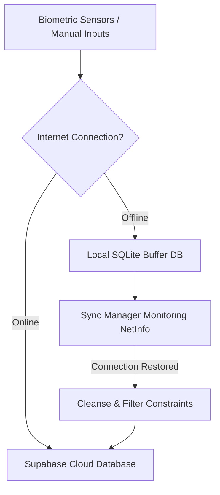

# AquaAyur 🌿📱

[](https://docs.expo.dev/versions/v56.0.0/)
[](https://reactnative.dev/)
[](https://www.typescriptlang.org/)
[](https://supabase.com/)
[](https://groq.com/)

AquaAyur is a modern, production-grade mobile health and wellness platform built on **React Native (Expo)**, **TypeScript**, **Zustand**, **SQLite**, **Supabase (PostgreSQL)**, and **Groq AI**. 

It merges the ancient medical wisdom of **Ayurveda** (Dosha bio-energetic assessment, tastes, lifestyle corrections) with state-of-the-art **IoT biometrics** streamed via Bluetooth Low Energy (BLE) from an ESP32 wearable sensor suite or simulated device.

---

## 🚀 Key Core Features (Deep-Dive)

### 📊 1. Intelligent Health & Recovery Dashboard (`index.tsx`)
* **Dynamic Wellness Index:** Calculates a daily Health & Recovery Index dynamically by aggregating the user's last 24-48 hours of average heart rate, skin temperature, and sleep scores.
* **Trend Indexing:** Compares active metrics against yesterday's benchmarks (e.g. `+4 points vs yesterday`) to show immediate health trajectory.
* **Ayurvedic Recommendation Engine:** Suggests real-time personalized daily recommendations depending on biometric states (e.g. balancing Pitta if skin temperature rises, or grounding Vata if heart rate fluctuates).
* **Offline Logger Modals:** Log sleep duration, bedtime, and wake times offline which queue automatically for cloud syncing.

### 👤 2. Ayurvedic Digital Twin (`digital-twin.tsx`)
* **Bio-Energetic Balances:** Visualizes the dynamic distribution of the user's active **Vata**, **Pitta**, and **Kapha** bio-energies using customized SVG radar and polygon charts.
* **Agni Metabolic Core Analyzer:** Computes the daily strength of the user's digestive fire (Agni) based on circadian meal timing, diet quality, vitals, hydration levels, physical activity, and sleep.
* **Ojas Vitality Shield:** Measures the user's physiological immune shield (Ojas) based on heart rate variability (HRV), sleep staging, and hydration consistency.
* **Interactive Lifestyle Simulation Engine:** Lets users run simulated scenarios (e.g., waking during Brahma Muhurta, eating warm spiced meals, doing yoga, sleeping early) to see the projected impact on their Doshas, Agni, and Ojas before executing them in real life.
* **AyurExplanationSheet:** Tapping on recommendations reveals clinical rationales contextualized with live biometric data.

### 🧘 3. Circadian Dinacharya Router & Breathing Coach (`dinacharya.tsx`)
* **Circadian Routine Planner:** Organizes the day into morning, afternoon, and evening phases, providing specific recommendations for Brahma Muhurta Awakening, Ushapan Hydration, solar-peak Ahara (midday meal), Vyayama (exercise), and Nidra (sleep).
* **Interactive Pranayama Coach:** Guided breathing tool supporting alternate-nostril breathing with a real-time visual progress timer (4s Inhale, 4s Hold, 4s Exhale) to pacify Vata wind and balance the nervous system.
* **Quick Loggers:** Single-tap logging buttons for sleep and hydration.

### 💬 4. Personal AI Ayurvedic Coach Chat (`coach.tsx`)
* **Conversational Expert:** Chat directly with an AI coach loaded with Ayurvedic texts. It uses Llama3 via Groq to answer dietary, herbal, and daily routine questions.
* **Structured Cards UI:** Features rich interactive cards (e.g., `[card: ...]`) displaying custom insights, recommended routines, or recipes.
* **Automatic Output Sanitizing:** Sanitizes messages by stripping markdown ticks, cleaning trailing tags, parsing raw JSON responses, and converting lists to clean, human-readable bold bullet points.

### 🌐 5. ESP32 Wearable Bluetooth Low Energy Integration (`device.tsx` / `bleManager.ts`)
* **Real-Time Data Streaming:** Connects to the custom AquaAyur wearable to stream live telemetry (Heart Rate, Skin Temperature, Steps, and active Activity state).
* **Persistent Pairing Profiles:** Persists paired hardware details (MAC address and friendly name) to the backend database.
* **Manual Autoconnect:** Restores connection to the previously paired wearable immediately on app start or upon explicit trigger via the **Previously Paired Device** dashboard card.
* **Robust Cancellation Interceptors:** Case-insensitive check filters that catch and suppress native `BleError: Operation was cancelled` and `BleError: BleManager was destroyed` messages when connections are cleanly cancelled or the app context unmounts.
* **Permissions Module:** Fully handles Android 12+ scan, connect, and legacy location permissions dynamically.

### 🍽️ 6. AI Food Journal & Analysis (`food-analysis.tsx` / `food-journal.tsx`)
* **Smart Calorie Tracker:** Log foods, meal times (Breakfast, Lunch, Dinner, Snack), and portion sizes.
* **Ayurvedic Taste & Dosha Mapping:** AI-powered analysis resolves the Ayurvedic taste (Sweet, Sour, Salty, Bitter, Pungent, Astringent) and outlines its positive or negative effects on the user's dominant Dosha.
* **OCR Scanner:** Features a nutrition label camera scanner to analyze macronutrients (Carbs, Protein, Fat, Fiber) and log entries instantly.

### 💻 7. BLE Virtual Wearable Simulator Lab (`simulator.tsx`)
* **Real-Time Simulation Control Panel:** Simulates an active physical wearable transmitting telemetry data packets.
* **Dosha Imbalance Presets:** Test app behavior under extreme profiles (Vata Out of Balance, Pitta Out of Balance, Kapha Out of Balance, or Healthy Equilibrium).
* **Physical Scenario Presets:** Pre-programmed setups for Exercise Surge, High Stress/Anxiety, Deep Sleep, and Normal Rest.
* **Interactive Telemetry Sliders:** Manually adjust Heart Rate, Skin Temperature, Steps, and Activity state variables on the fly.

### 📈 8. Weekly Analytics & Groq Reports (`insights.tsx`)
* **Auto-Compilation:** Checks if the user has biometric logs but no report, and automatically compiles their initial week-long wellness overview using Groq Llama3 analysis.
* **Historical Trends:** Dynamic line graphs rendering metrics (Heart Rate, Skin Temperature, Steps, Sleep) across the last 7 days.
* **Baseline Normalization:** Normalizes missing data using overall historical telemetry averages rather than generic hardcoded values.

---

## 🛠️ Technology Stack & Libraries

| Dependency | Purpose | Version |
| :--- | :--- | :--- |
| **Expo Router** | Native routing using a file-based structure | `~56.2.14` |
| **React Native** | Cross-platform native application framework | `0.85.3` |
| **NativeWind & Tailwind CSS** | Unified styling and design tokens | `^5.0.0-preview.4` |
| **react-native-ble-plx** | Handles Bluetooth Low Energy interactions, scans, and subscriptions | `^3.5.1` |
| **expo-sqlite** | Fast local SQLite database for offline buffering | `~56.0.5` |
| **Supabase JS Client** | Remote database client and authentication interface | `^2.106.2` |
| **@clerk/clerk-expo** | Secure authentication provider integration | `^2.19.31` |
| **@groq/sdk** | Connects to high-performance Llama3 endpoints for OCR, chat, and reports | Latest |
| **react-native-safe-area-context** | SafeArea inset calculators for multiple screen sizes | `~5.7.0` |
| **react-native-reanimated** | Fluid micro-animations and screen transitions | `4.3.1` |

---

## 📂 Codebase Directory Structure

```text
Ayurveda/
├── assets/                     # App icons, splash screens, and static image assets
├── supabase_complete_schema.sql # Master Postgres DDL tables & triggers migration script
└── src/
    ├── app/                    # Expo Router file-based screens
    │   ├── _layout.tsx         # App wrapper, initialization, Clerk & Supabase auth guard
    │   ├── oauth-native-callback.tsx # OAuth login redirect landing handler
    │   ├── (auth)/             # Authentication routes
    │   │   ├── login.tsx       # Clerk-powered sign-in & sign-up forms
    │   │   ├── onboarding.tsx  # Dynamic multi-step Dosha constitution quiz
    │   │   └── reset-password.tsx # Reset Password trigger
    │   └── (tabs)/             # Main tab-bar layouts and dashboard screens
    │       ├── _layout.tsx     # Tab configuration and custom animated tab bar
    │       ├── index.tsx       # Intelligent Health & Recovery Dashboard
    │       ├── coach.tsx       # AI Ayurvedic Coach Chat Screen
    │       ├── device.tsx      # Bluetooth Wearable Scanner & Config Screen
    │       ├── device-details.tsx # Live metrics details for paired hardware
    │       ├── live-monitor.tsx # Real-time line graphs streaming sensor packets
    │       ├── digital-twin.tsx # Ayurvedic Digital Twin (Dosha/Agni/Ojas & Sim Engine)
    │       ├── dinacharya.tsx  # Circadian Routine Tracker & Pranayama Coach
    │       ├── food-journal.tsx # Food logging list and meal stats
    │       ├── food-analysis.tsx # AI Ayurvedic Taste Analyzer & OCR scanner
    │       ├── insights.tsx    # Weekly Analytics & AI Summary Reports
    │       ├── profile.tsx     # User demographics & Onboarding Dosha Profile
    │       ├── settings.tsx    # App preferences, database status, and dev controls
    │       └── simulator.tsx   # Virtual wearable simulator lab controls
    ├── components/             # Reusable UI widgets
    │   ├── MetricTrendChart.tsx # SVG line charts showing health metrics
    │   ├── animated-icon.tsx   # Micro-animated tab bar icons
    │   └── themed-view.tsx     # Custom container wrapping safe margins
    ├── services/               # Underlying application services
    │   ├── bleManager.ts       # Bluetooth connection, read/writes, and subscription handlers
    │   ├── database.ts         # SQLite instance initialization & insertion helpers
    │   ├── syncManager.ts      # NetInfo event listeners & SQLite -> Supabase push routines
    │   ├── aiCoachService.ts   # Chat completions interface using Groq SDK
    │   └── sensorManager.ts    # Manages simulation modes & sensor profiles
    ├── store/                  # Zustand global state modules
    │   ├── useAuthStore.ts     # User sessions & Supabase auth tokens
    │   ├── useBLEStore.ts      # Biometrics, live monitor charts, & BLE state
    │   ├── useSleepStore.ts    # Sleep logs, duration scoring, & local triggers
    │   └── useTelemetryStore.ts# Week-long telemetry caching for index metrics
    ├── types/                  # Shared TypeScript type definitions
    └── utils/                  # Safe validation and string decoder utilities
```

---

## 🔄 Offline Sync Architecture

AquaAyur implements a robust offline-first synchronization strategy. Telemetry, hydration, and sleep logs captured offline are stored in a local SQLite queue and dynamically uploaded to Supabase PostgreSQL when internet connectivity is re-established.



---

## 🗄️ Database Schemas

### ☁️ Supabase Cloud (Postgres SQL)
Every table is secured with Row Level Security (RLS) policies checking `(auth.jwt() ->> 'sub') = user_id`.

* **`profiles`**: Primary user demographic details, goals, and onboarding `dominant_dosha`.
* **`medical_conditions` / `allergies` / `food_preferences` / `health_goals`**: Normalized tables storing user-specific onboarding profile items.
* **`lifestyle`**: 1:1 relation with user profiles tracking sleep duration average, stress levels, and exercise frequency.
* **`devices` & `pairings`**: Device catalog (uniquely mapping MAC addresses) and pairing states.
* **`heart_rate_logs`**: Timestamps, heart rates, and HRV values. Restricted to `bpm > 0 AND bpm < 300`.
* **`temperature_logs`**: Skin temperatures restricted to `temperature_celsius > 30.0 AND temperature_celsius < 45.0`.
* **`activity_logs`**: Step metrics, calorie estimations, and classifications (`sedentary`, `walking`, `running`, `yoga`, `other`).
* **`sleep_logs`**: Bedtime, wake time, sleep stages (Deep, Light, REM, Awake), and calculated sleep score.
* **`hydration_logs`**: Hydration increments in mL, tracking source context (`manual`, `wearable_alert`, `ai_recommendation`).
* **`food_logs` & `nutrition_analysis`**: Logged meals connected to macronutrient levels and analyzed Ayurvedic qualities.
* **`ai_insights` & `chat_history`**: Cached weekly analysis results and chat histories.

### 💾 Local Cache (SQLite)
Maintained using `expo-sqlite` to buffer metrics offline:
* **`offline_telemetry`**: `(id, timestamp, heart_rate, skin_temperature, steps, activity)`
* **`offline_hydration`**: `(id, timestamp, amount_ml, source)`
* **`offline_sleep`**: `(id, start_time, end_time, duration_minutes, sleep_score)`

---

## ⚙️ Installation & Local Setup

### Prerequisites
* **Node.js** (v18+)
* **Android SDK / Android Studio** (to run on Android devices/emulators)
* **CocoaPods & Xcode** (if running on macOS for iOS devices/simulators)
* **Java Development Kit (JDK 17)** (Required for Android builds)

### Installation
1. Clone the project repository and install package dependencies:
   ```bash
   npm install
   ```

2. Create a `.env` file in the root directory and add your variables:
   ```env
   EXPO_PUBLIC_SUPABASE_URL=https://your-supabase-project.supabase.co
   EXPO_PUBLIC_SUPABASE_ANON_KEY=your-supabase-anon-key
   EXPO_PUBLIC_GROQ_API_KEY=your-groq-api-key
   ```

3. Initialize your local Android build profile:
   ```bash
   npx expo run:android
   ```

4. Run the development environment:
   ```bash
   npm run dev
   ```

---

## 📱 Pairing a Wireless Android Device

If you are developing or testing with a physical Android device over Wi-Fi (Wireless Debugging):

1. **Verify Subnet:** Ensure both your development computer and your Android device are connected to the same Wi-Fi network.
2. **Retrieve Pairing Details:** On your Android device, go to **Settings** > **Developer Options** > **Wireless Debugging** > Tap **Pair device with pairing code**.
3. **Execute ADB Commands:**
   Use the absolute path to your Android SDK's `platform-tools` directory (usually located under AppData locally) to pair and connect:
   
   ```powershell
   # 1. Pair the device (replace with the IP, port, and code displayed on your screen)
   & C:\Users\<Username>\AppData\Local\Android\Sdk\platform-tools\adb.exe pair 192.168.0.101:40887 998685
   
   # 2. Find the connect port (Android dynamically generates a different port for connection)
   & C:\Users\<Username>\AppData\Local\Android\Sdk\platform-tools\adb.exe mdns services
   
   # 3. Connect to the device using the port retrieved from the previous command
   & C:\Users\<Username>\AppData\Local\Android\Sdk\platform-tools\adb.exe connect 192.168.0.101:<connect_port>
   
   # 4. Verify the device is connected
   & C:\Users\<Username>\AppData\Local\Android\Sdk\platform-tools\adb.exe devices
   ```

---

## 💡 Important Architectural Solutions

### ⚠️ Android TextInput Casing Crash
Android's native `TextInput` crashes if `fontFamily` receives an array fallback (e.g. `['monospace', 'sans-serif']` compiled by NativeWind from `font-mono`). To prevent this, the input elements in the sleep modal and food inputs use an inline style bypass:
```tsx
style={{ fontFamily: 'monospace' }}
```

### 🚨 NativeWind ClassName Warnings
Dynamic/conditional rendering toggling spacing classes (like `mb-6`) sometimes triggers NativeWind reset warnings. We resolved this by:
1. Adding unique `key` parameters to conditional siblings.
2. Adding `will-change-variable` class modifiers to warning-prone nodes.

### 🛡️ BLE Stream Cancellation Handling
When a device is explicitly disconnected, the monitor subscription triggers a callback with `BleError`. We intercept this error, inspect it, and suppress standard warnings when the connection is cancelled cleanly:
```typescript
const errMsg = (error.message || '').toLowerCase();
if (
  errMsg.includes('cancelled') ||
  errMsg.includes('canceled') ||
  errMsg.includes('destroyed') ||
  error.errorCode === BleErrorCode.OperationCancelled ||
  error.errorCode === BleErrorCode.BluetoothManagerDestroyed
) {
  console.log('[BLE] Streaming monitor subscription cancelled cleanly.');
  return;
}
```

---

## 📄 License

This project is licensed under the MIT License - see the [LICENSE](file:///d:/Projects/Ayurveda/LICENSE) file for details.
